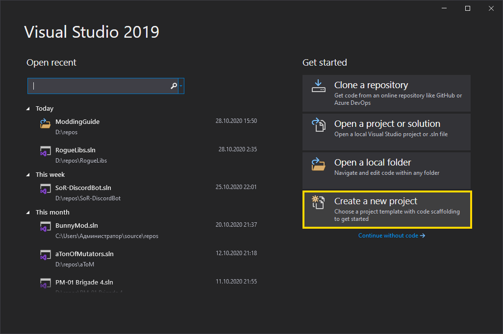
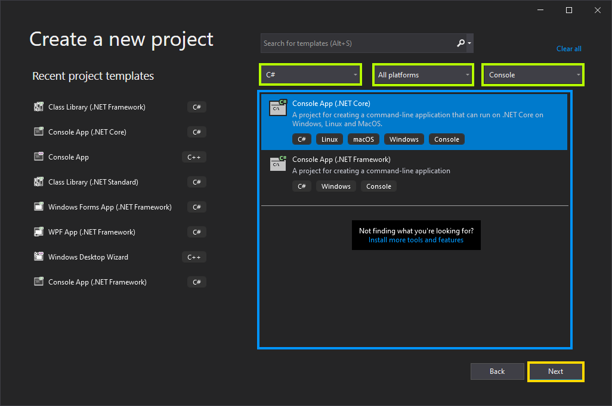
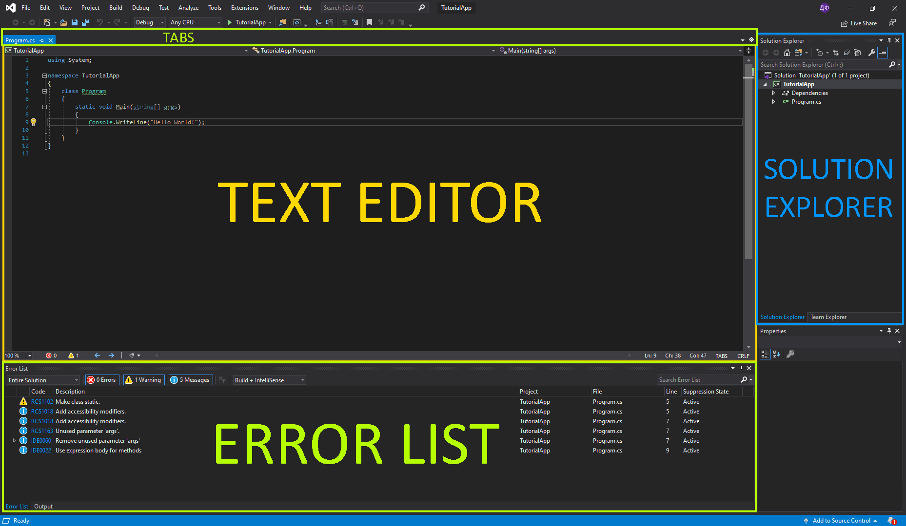
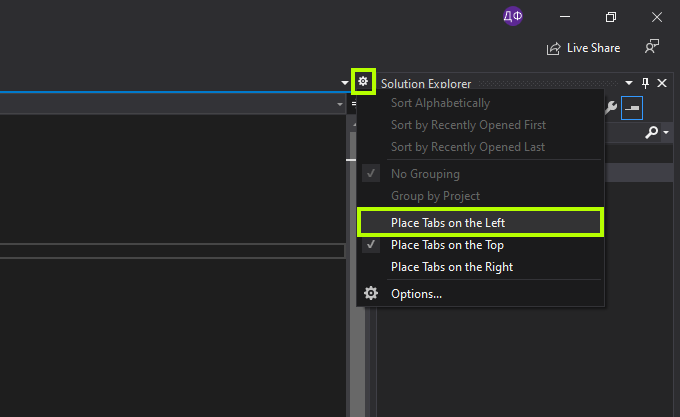
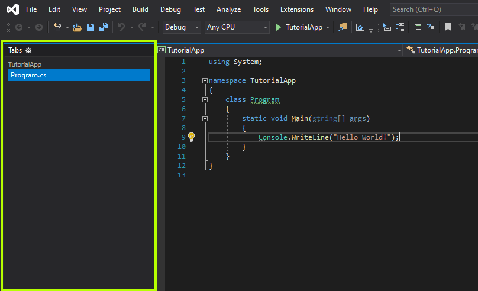
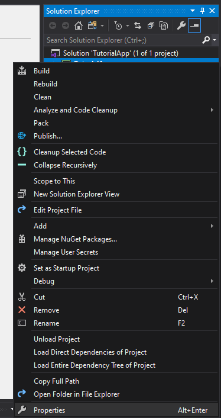
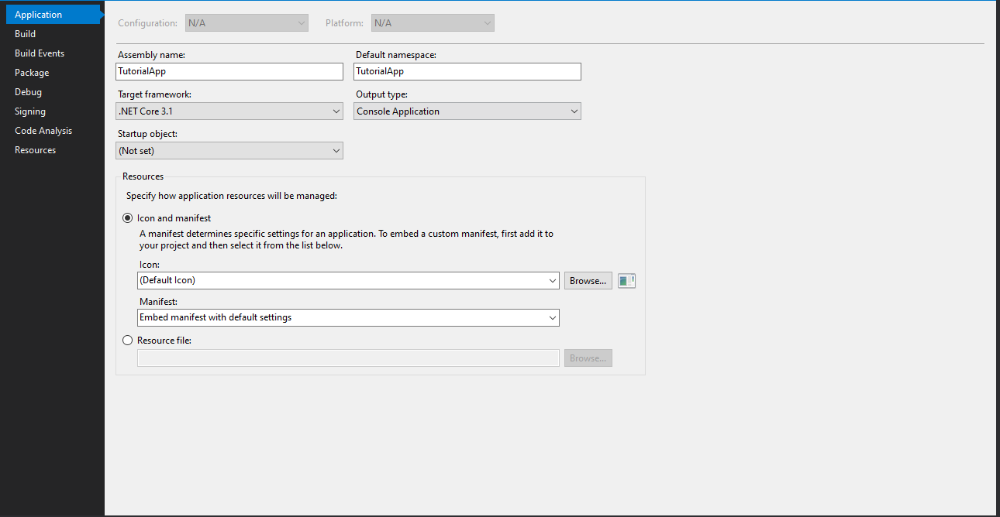

### [BACK TO THE MAIN PAGE](../../README.md) ###

1. **[Creating a Project in Visual Studio](./1-Creating-a-Project.md)**;
2. **[Basics of C#](./2-Basics-of-CSharp.md)**;
3. **[Working with Numbers](./3-Working-with-Numbers.md)**;

## Creating a Project in Visual Studio ##

***Projects** contain all source files (source code, icons, data and resources), that are compiled into an executable, library or something else. They also contain configuration files and compiler settings specific for this project.*

***Solution** is just a container for multiple projects.*

To begin programming, we'll need to create new project in Visual Studio. Run Visual Studio and select "Create a new project".

Then find a project template that you want to use. There are 3 dropdown menus that you can use to filter templates: Language, Platform and Project Type. I recommend starting with a Console App (.NET Core or .NET Framework), it will be the one I'll be using in this guide. After selecting a project template click "Next".

Now set the project and solution names and their location. You shouldn't use any special characters, punctuation or whitespaces in the names to ensure compatibility with stuff. For location I recommend creating a new folder right in the root directory of a drive, so the path to the project is short (in this case "D:\repos\TutorialApp" instead of default "C:\Users\Administrator\source\repos\TutorialApp"). Then click "Create".

*You can also put the project in the same folder as the solution, but I wouldn't recommend it, because, who knows, maybe you'll need to create another project, an extension or a test of the original.*

Now you should see a layout like this:

- **Text/Code Editor** is the main area, where you will be doing all of the coding.
- **Solution Explorer** allows you to switch between different projects, access project properties and add references.
- **Error List** is a part, that you're gonna spend most of the time looking at (just kidding). All errors, warnings and recommendations will show up in this window.
- **Tabs** is a list of opened files. *I recommend moving it to the side using a cog icon on the right, so you can see more tabs at the same time.*

You can add more information about your project in its properties. Just right click on the project in the Solution Explorer and select "Properties" at the very bottom.

