### [BACK TO THE MAIN PAGE](../../README.md) ###

1. **Creating a project in Visual Studio**;
2. [Working with numbers](./2-Working-with-numbers.md);
3. [Statements, expressions and operators](./3-Statements-expressions-and-operators.md);
4. [Branches and loops](./4-Branches-and-loops.md);

# Creating a project in Visual Studio #

***Projects** contain all source files (source code, icons, data and resources), that are compiled into an executable, library or something else. They also contain configuration files and compiler settings specific for this project.*

***Solution** is just a container for multiple projects.*

## Creating a project ##

To start programming, we'll need to create a project in Visual Studio first. Run Visual Studio and select "Create a new project".

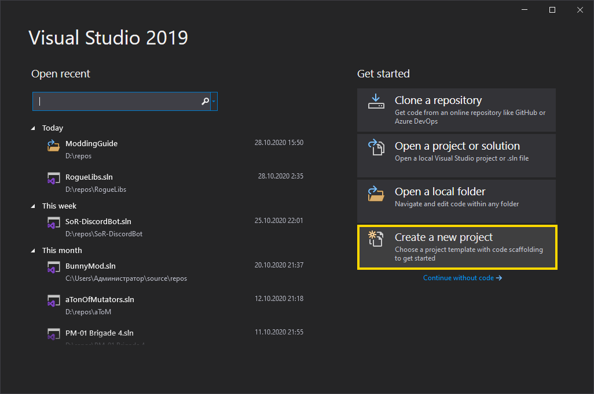

Then find a project template that you want to use. There are 3 dropdown menus that you can use to filter templates: Language, Platform and Project Type. I recommend starting with a Console App (.NET Core or .NET Framework), it will be the one I'll be using in this guide. After selecting a project template click "Next".


Now set the project and solution names and their location. You shouldn't use any special characters, punctuation or whitespaces in the names to ensure compatibility with stuff. For location I recommend creating a new folder right in the root directory of a drive, so the path to the project is short (in this case "D:\repos\TutorialApp" instead of default "C:\Users\Administrator\source\repos\TutorialApp"). Then click "Create".

*You can also put the project in the same folder as the solution, but I wouldn't recommend it, because, who knows, maybe you'll need to create another project, an extension or a test of the original.*

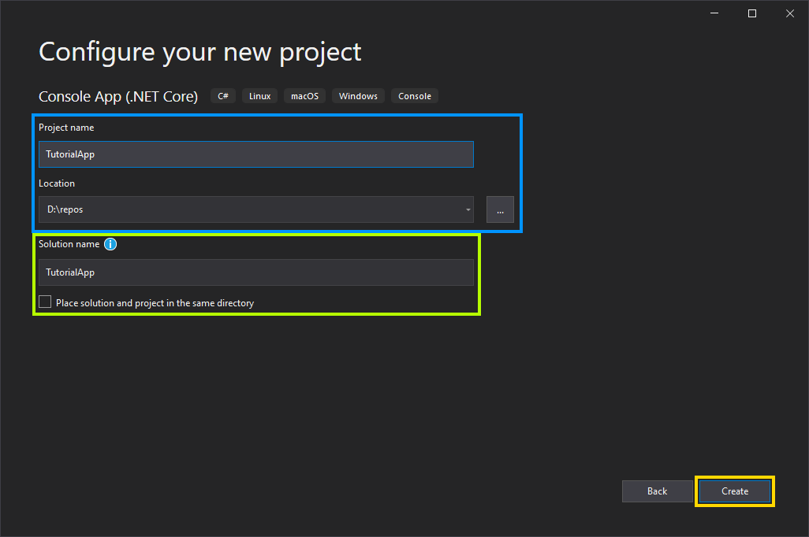

Now you should see a layout like this:

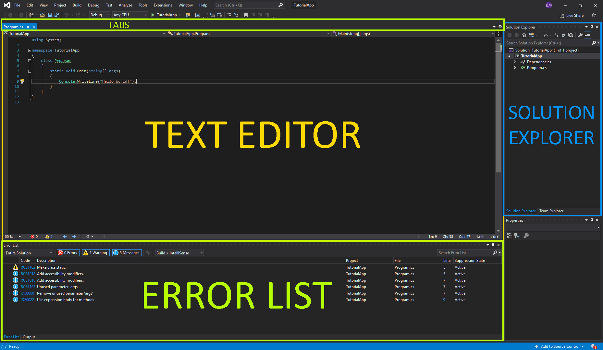

- **Text/Code Editor** is the main area, where you will be doing all of the coding.
- **Solution Explorer** allows you to switch between different projects, access project properties and add references.
- **Error List** is a part, that you're gonna spend most of the time looking at (just kidding). All errors, warnings and recommendations will show up in this window.
- **Tabs** is a list of opened files. *I recommend moving it to the side using a cog icon on the right, so you can see more tabs at the same time.*

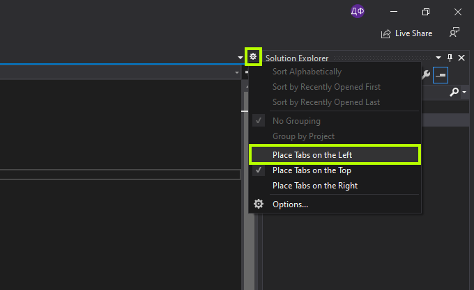

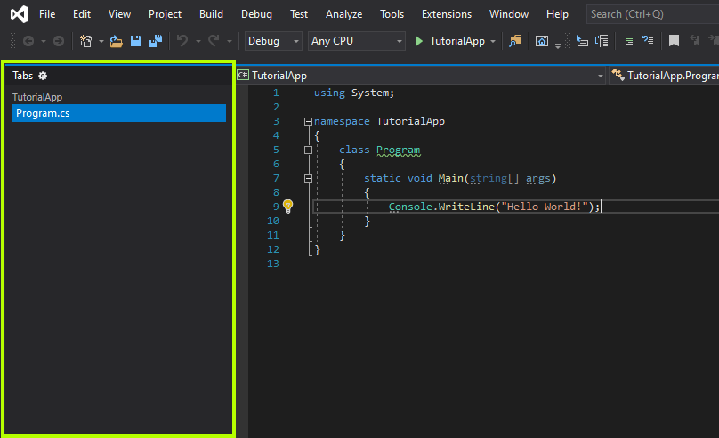

You can add more information about your project in its properties. Just right click on the project in the Solution Explorer and select "Properties" at the very bottom.

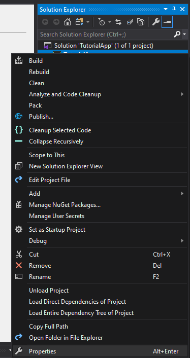

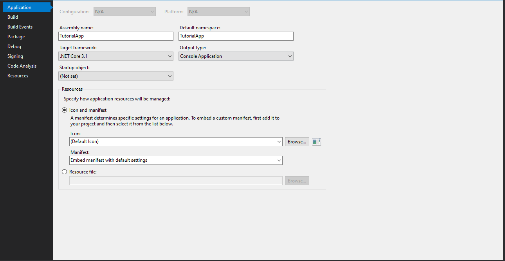

Now that you've created your project, you can start actually programming.

## Basics of C# Programming ##

**C# is a strongly typed language, so every variable must have a type, that will determine its value, stored data, size and ways to access and convert that data.**

***Namespaces** are used to organize types in .NET. Types in namespaces can be accessed like this: `<namespace>.<type name>` (for example, `System.Console`). Or, if you add `using System;` to the beginning of the file, you can omit the `<namespace>.` part: `Console`.*

---

Let's look at the code generated by default.

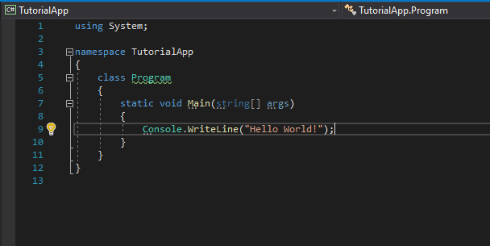

IntelliSense will probably show a couple of warnings and messages, so just replace everything in the file with this. You'll understand why you need these changes later.

```cs
using System;

namespace TutorialApp
{
    public class Program
    {
        public static void Main(/*string[] args*/)
        {
            Console.WriteLine("Hello World!");
        }
    }
}
```

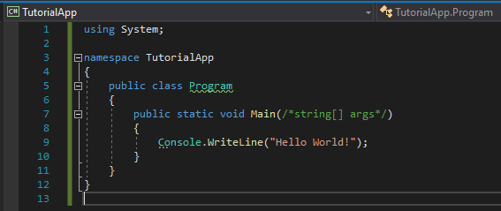

Now let's look at the code.

**`using System;`** specifies that we're going to use types from that namespace (`Console`).

**`namespace TutorialApp { ... }`** specifies that the types inside this block will be in this namespace. The code inside a certain namespace can access all types in it, so there's no need to write `using TutorialApp;` in the beginning.

**`public class Program { ... }`** declares a class called "Program". We'll talk about classes and types later.

**`public static void Main(/*string[] args*/) { ... }`** declares a method called "Main". Parameter `string[] args` is optional and we commented it out, so the method has no parameters. *By default, this is the entry point of your program. Its class should be called "Program" and the method - "Main".*

**`Console.WriteLine("Hello World!");`** calls a method `WriteLine` in the class `Console` with 1 parameter - `"Hello World!"`.

---

Okay, let's try to run this program. Find and press a green play button in the toolbar above the text editor.

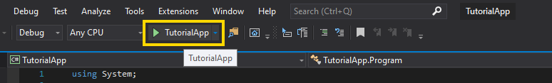

After the program is compiled, you will see a console window with "Hello World!" printed on the first line.

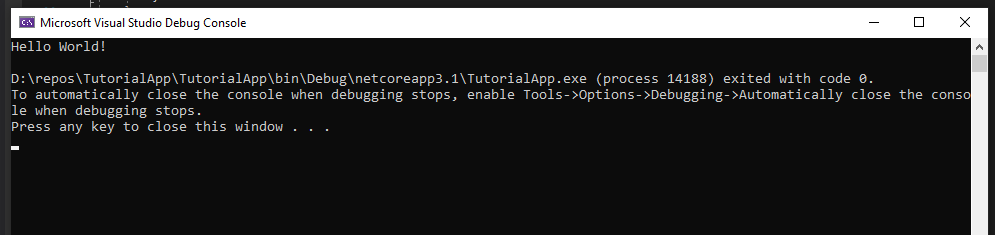

Now let's declare a variable of type `double` (a double-precision floating-point number) and assign some number to it: `double a = 420.69;`.

And to know that our program is different, let's add this number to the end of `"Hello World!"` string. When appending an object to a string, that object is converted to an equivalent string representation. In this case, `"420.69"`.

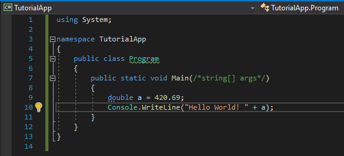

Let's run the program again and look at the result.

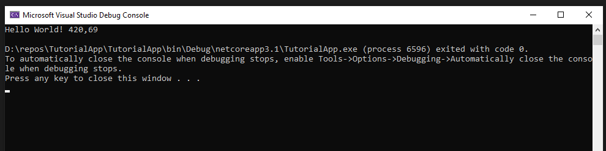

Great job! About 50% of all people get to this point. Most of the other half just give up, because everything seems too complicated. But don't worry, you don't understand anything because you don't know anything. It's natural. You can't understand a language just by knowing a couple of words.

## Next: 2. [Working with numbers](./2-Working-with-numbers.md) ##