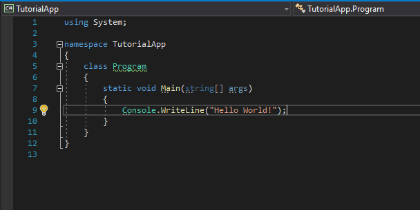
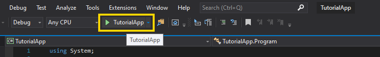
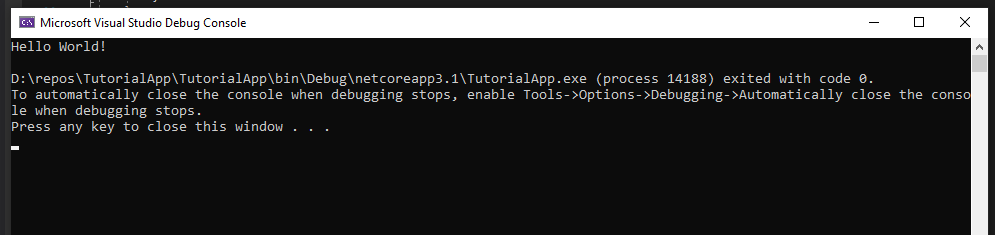
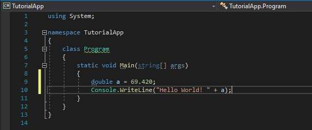

### [BACK TO THE MAIN PAGE](../../README.md) ###

1. **[Creating a Project in Visual Studio](./1-Creating-a-Project.md)**;
2. **[Basics of C#](./2-Basics-of-CSharp.md)**;
3. **[Working with Numbers](./3-Working-with-Numbers.md)**;

## Basics of C# ##

**C# is a strongly typed language, so every variable must have a type, that will determine its value, stored data, size and ways to access and convert that data.**

***Namespaces** are used to organize types in .NET. Types in namespaces can be accessed like this: `<namespace>.<type name>` (for example, `System.Console`). Or, if you add `using System;` to the beginning of the file, you can omit the `<namespace>.` part: `Console`.*

---

Let's look at the code generated by default:



```cs
using System;

namespace TutorialApp
{
    class Program
    {
        static void Main(string[] args)
        {
            Console.WriteLine("Hello World!");
        }
    }
}
```

**`using System;`** specifies that we're going to use classes from that namespace (`Console`).

**`namespace TutorialApp { ... }`** specifies that the classes inside this block will be in this namespace. The code inside a certain namespace can access all types in it, so there's no need to write `using TutorialApp;` in the beginning.

**`class Program { ... }`** declares a class called "Program". We'll talk about classes and types later.

**`static void Main(string[] args) { ... }`** declares a method called "Main". *By default, this is the entry point of your program. Its class should be called "Program" and the method - "Main".*

**`Console.WriteLine("Hello World!");`** calls a method `WriteLine` in the class `Console` with 1 parameter `"Hello World!"`.

---

Okay, let's try to run this program. Find and press a green play button in the toolbar above the text editor.



After the program is compiled, you will see a console window with "Hello World!" printed on the first line.



Now, let's declare a variable of type `double` (a double-precision floating-point number) and assign some number to it: `double a = 69.420;`.

And to know that our program is different, let's add this number to the end of `"Hello World!"` string.



Let's run the program again and look at the result.


Good job! About 50% of all people get to this point. Most of the other half just give up, because everything seems too complicated. But don't worry, you don't understand anything because you don't know anything. It's natural. You can't understand a language just by knowing a couple of words.

---


