### [НА ГЛАВНУЮ СТРАНИЦУ](../../README.md) ###

1. **Создание проекта в Visual Studio**;
2. [Работаем с числами](./2-Working-with-numbers.md);
3. [Высказывания, выражения и операторы](./3-Statements-expressions-and-operators.md);

# Создание проекта в Visual Studio #

***Проекты** хранят в себе все исходные файлы (исходный код, иконки, данные и ресурсы), которые компилируются в приложение, библиотеку или что-то ещё. Они также содержат файлы настроек и настройки компилятора, специфичные для этого проекта.*

***Решение** - это всего лишь способ хранения нескольких проектов в одном месте.*

## Создание проекта ##

Чтобы начать программировать, нам сначала необходимо создать проект в Visual Studio. Запустите Visual Studio и выберите "Создание проекта".

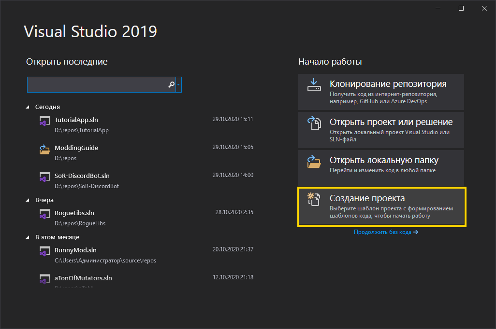

Теперь найдите шаблон проекта, который вы хотели бы использовать. Тут есть 3 меню с выпадающим списком для фильтрации шаблонов: Язык, Платформа и Тип проекта. Я рекомендую начинать с Консольного приложения (.NET Core или .NET Framework), его я и буду использовать в этом гайде. После выбора шаблона нажимаем "Далее".

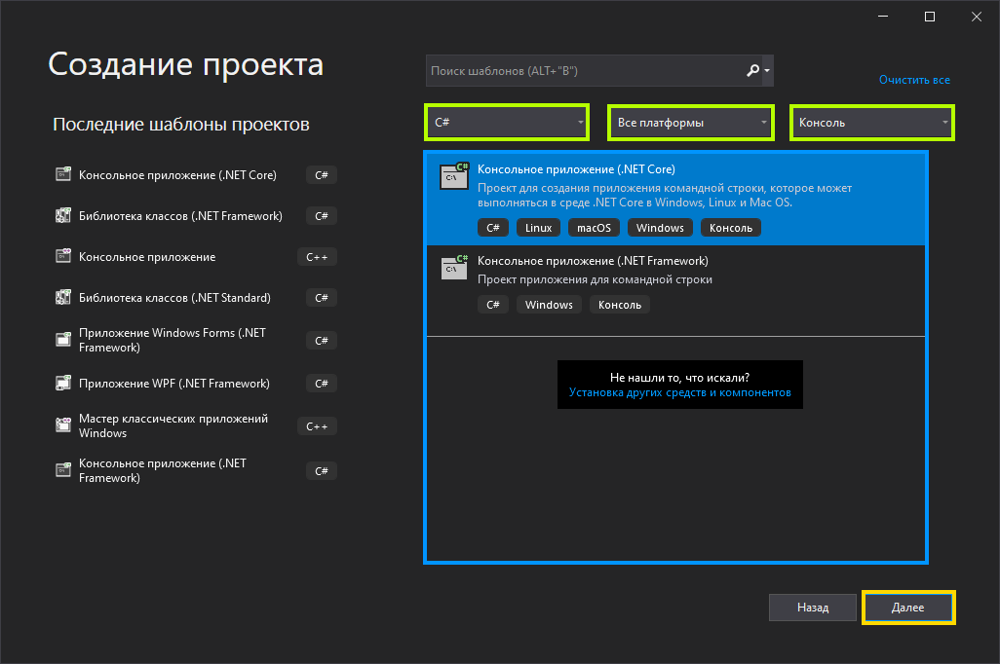

Теперь выставляем названия проекта и решения и их расположение. Не используйте особые символы, пунктуацию или пробелы в названиях, чтобы не было никаких проблем со совместимостью. Для расположения я рекомендую создать новую папку прямо в корне диска, чтобы путь к проекту был небольшим (в этом случае "D:\repos\TutorialApp" вместо стандартного "C:\Users\Администратор\source\repos\TutorialApp"). После этого нажмите "Создать".

*Вы можете также положить проект в ту же папку, где и решение, но я бы не советовал, ведь, кто знает, может вам понадобится создать ещё один проект, расширение или тест оригинала.*

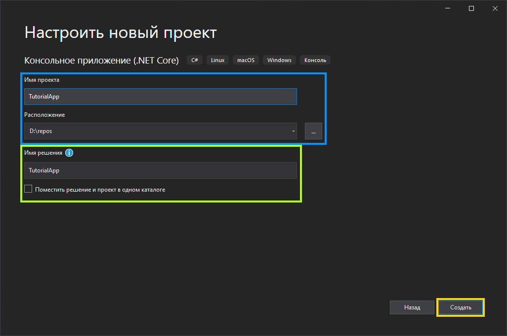

Теперь вы должны увидеть примерно такое окно:

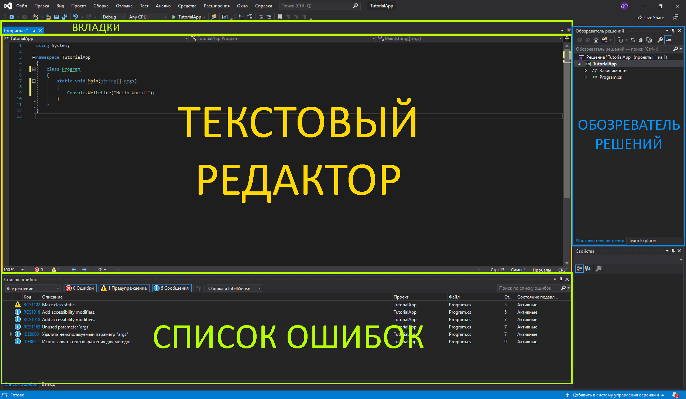

- **Текстовый редактор/редактор кода** - главная зона, в которой вы будете делать весь код.
- **Обозреватель решений** позволяет вам переключаться между разными проектами, обращаться к свойствам проектов и добавлять ссылки.
- **Список ошибок** - это часть, смотря на которую вы будете тратить много времени (шучу). Все ошибки, предупреждения и рекомендации будут появляться в этом окне.
- **Вкладки** - это список открытых файлов. *Я рекомендую перенести их в бок, используя шестерёнку справа, чтобы вы могли видеть больше файлов одновременно.*

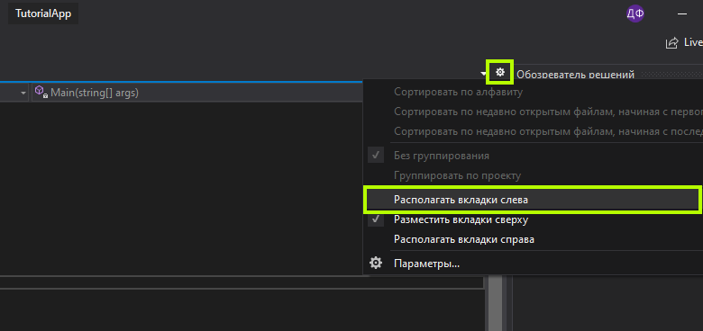

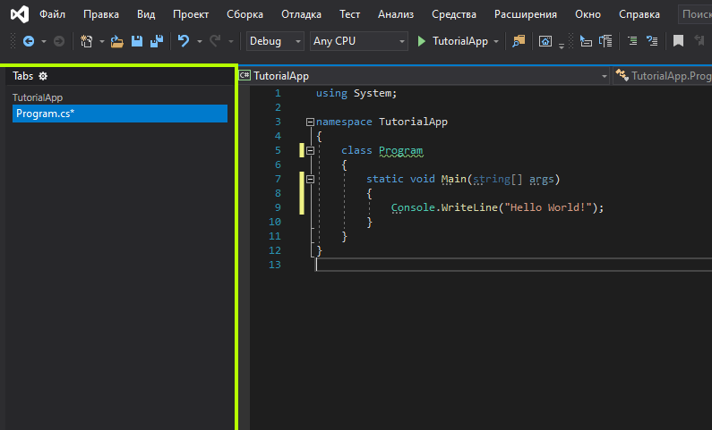

Вы можете добавить больше информации о своём проекте в его свойствах. Просто кликните правой кнопкой мыши по проекту в Обозревателе решений и выберите "Свойства" в самом низу.

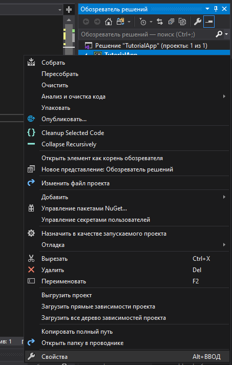

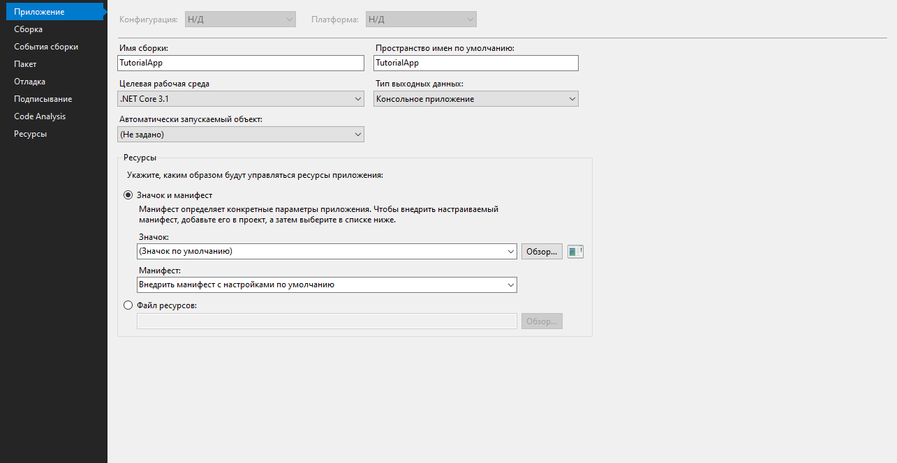

Теперь, когда вы создали проект, можно начинать программировать.

## Basics of C# Programming ##

**C# - строго типизированный язык, а то есть у каждой переменной должен быть тип, который будет определять её значение, хранящиеся данные, размер и способы обращения к этим данным и их конвертации.**

***Пространства имён** используются для систематизации типов в .NET. Обратиться к типам в пространстве можно так: `<пространство имён>.<название типа>` (например, `System.Console`). Или, если добавить `using System;` в начало файла, то можно опустить часть `<пространство имён>.`: `Console`.*

---

Давайте посмотрим на код, сгенерированный по умолчанию.


IntelliSense скорее всего покажет несколько предупреждений и сообщений, поэтому просто замените всё в файле на код ниже. Вы поймёте зачем нужны эти изменения позже.

```cs
using System;

namespace TutorialApp
{
    public class Program
    {
        public static void Main(/*string[] args*/)
        {
            Console.WriteLine("Hello World!");
        }
    }
}
```

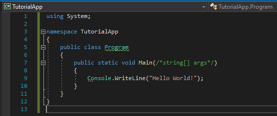

А теперь посмотрим на код.

**`using System;`** указывает, что мы собираемся использовать типы из этого пространства имён (`Console`).

**`namespace TutorialApp { ... }`** указывает что типы, находящиеся внутри этого блока, будут принадлежать этому пространству имён. Код внутри определённого пространства имён может обращаться ко всем типам внутри него, поэтому нет необходимости писать `using TutorialApp;` в начале.

**`public class Program { ... }`** объявляет класс под названием "Program". Мы поговорим о классах и типах позже.

**`public static void Main(/*string[] args*/) { ... }`** объявляет метод под названием "Main". Параметр `string[] args` необязательный и мы его закомментировали, поэтому у метода нету параметров. *По умолчанию, это - входная точка вашей программы. Его класс должен называться "Program" , а метод - "Main"*

**`Console.WriteLine("Hello World!");`** вызывает метод `WriteLine` в классе `Console` с 1 параметром - `"Hello World!"`.

---

Ладно, теперь попробуем запустить эту программу. Найдите и нажмите кнопку с зелёным значком Play в панели инструментов над текстовым редактором.

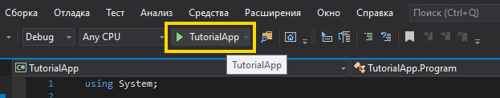

После компиляции программы, вы увидите окно консоли с "Hello World!", напечатанным на первой строчке.

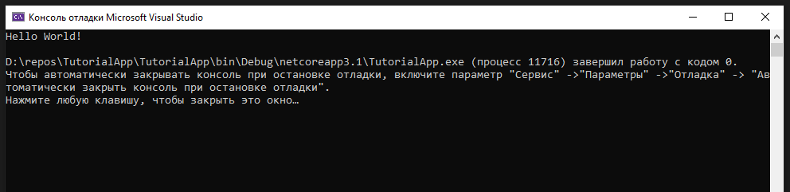

Теперь давайте объявим переменную типа `double` (число с плавающей запятой двойной точности) и присвоим ей какое-нибудь значение: `double a = 420.69;`.

И чтобы убедиться, что наша программа изменилась, добавим это число к концу строки `"Hello World!"`. При прибавлении объекта к строке, этот объект конвертируется в эквивалентное строковое представление. В этом случае, `"420.69"`.

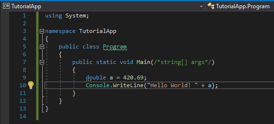

Давайте запустим программу ещё раз и посмотрим на результат.

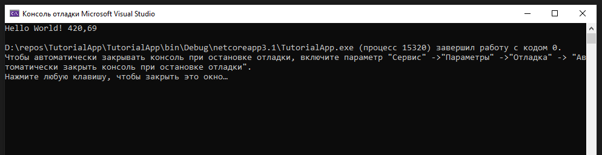

Отлично! Лишь около 50% добираются до этого пункта. Большинство другой половины просто сдаются, так как им всё кажется слишком сложным. Но не волнуйтесь, вы ничего не понимаете, потому что вы ничего не знаете. Это нормально. Вы не можете начать понимать язык, зная лишь несколько его слов.

## Следующее: 2. [Работаем с числами](./2-Working-with-numbers.md) ##